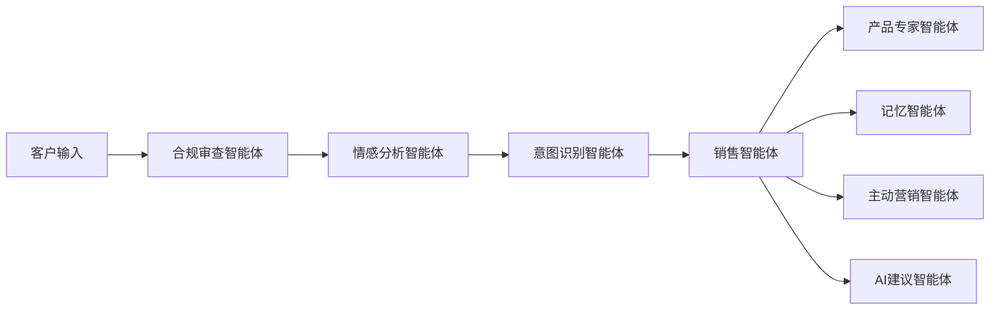

# MAS 智能营销助手

基于 LangGraph 的多智能体系统，专为医美行业打造的数字化营销解决方案，通过 AI 智能体替代传统人工客服，实现自然人性化的销售对话。

## 🎯 项目概述

本系统构建了一个复杂的多智能体生态系统，包含 8 个专业化智能体协同工作，为美妆品牌提供：

- **🤖 智能销售对话** - 模拟专业美妆顾问的语调和专业知识
- **🎙️ 多模态交互** - 支持文字、语音、图像多种输入方式
- **🧠 持久化记忆** - 基于 Elasticsearch 的客户偏好记忆系统
- **📊 智能推荐** - RAG 驱动的个性化产品推荐引擎
- **🔄 多LLM支持** - 集成 OpenAI、Anthropic、Gemini、DeepSeek 智能路由
- **🏢 多租户支持** - 支持多个医美品牌独立运营
- **☁️ 云端部署** - Docker Compose 容器化部署方案
- **🔐 企业级安全** - JWT 认证、租户隔离、速率限制

## 🏗️ 系统架构

### 八大智能体协作流程



### 智能体职责分工

1. **🛡️ 合规审查智能体** - 法规合规性验证，内容安全检查（8个模块）
2. **😊 情感分析智能体** - 多模态情绪状态实时评估（7个模块）
3. **🎯 意图识别智能体** - 客户购买意图和需求分析
4. **💬 销售智能体** - 主要对话管理和销售策略执行（2个模块）
5. **🔍 产品专家智能体** - RAG 驱动的产品知识和推荐（10个模块）
6. **💾 记忆智能体** - 客户档案管理和多模态记忆持久化（2个模块）
7. **⚡ 主动营销智能体** - 基于行为触发的主动客户接触
8. **🤝 AI建议智能体** - 人机协作的智能建议系统（8个模块）

## 🚀 快速开始

### 系统要求

- Python 3.11+
- uv 包管理器
- Docker 和 Docker Compose
- LLM API 密钥（OpenAI、Anthropic、Gemini、DeepSeek 中至少一个）

### 一键部署

1. **初始化开发环境**
   ```bash
   ./scripts/setup.sh
   ```

2. **配置环境变量**
   编辑 `.env` 文件，添加您的 LLM API 密钥：
   ```bash
   cp .env.example .env
   ```

3. **启动基础设施服务（开发环境）**
   ```bash
   docker compose -f docker-compose.dev.yml up -d
   ```

4. **运行 API 应用程序**
   ```bash
   cd api
   uv run main.py
   ```

### 手动部署

如果您偏好手动配置：

1. **安装依赖包**
   ```bash
   cd api
   uv sync
   ```

2. **启动基础设施服务**
   ```bash
   docker compose -f docker-compose.dev.yml up -d
   ```

3. **启动 API 服务器**
   ```bash
   cd api
   uv run main.py
   ```

## 📁 项目结构

```
mas-v0.2/
├── docker-compose.yml       # 生产环境容器编排
├── docker-compose.dev.yml   # 开发环境容器编排
├── api/                     # 后端服务（完整的 Python API）
│   ├── main.py              # FastAPI 应用入口点
│   ├── controllers/         # API 控制器和中间件
│   │   ├── middleware/      # JWT认证、安全拦截、租户隔离、速率限制
│   │   └── ...              # 其他控制器
│   ├── src/                 # 核心业务逻辑
│   │   ├── agents/          # 8个模块化智能体（37个子模块）
│   │   ├── core/            # LangGraph 工作流编排
│   │   ├── memory/          # Elasticsearch 存储（11个模块）
│   │   ├── multimodal/      # 语音和图像处理（12个模块）
│   │   └── rag/             # 检索增强生成系统
│   ├── infra/               # 基础设施组件
│   │   ├── auth/            # JWT 认证系统
│   │   ├── cache/           # Redis 集成
│   │   ├── db/              # 数据库连接
│   │   └── monitoring/      # 健康监控
│   ├── legacy_api/          # 传统 API 端点
│   │   └── endpoints/       # 10个 REST API 端点模块
│   ├── models/              # 数据模型定义
│   ├── services/            # 业务服务层
│   ├── repositories/        # 数据访问层
│   ├── migrations/          # 数据库迁移文件
│   ├── test/                # 全面的测试套件（22个模块）
│   ├── config/              # 应用配置管理
│   ├── utils/               # 工具函数
│   └── scripts/             # 开发和部署脚本
├── web/                     # 前端应用（Next.js）
│   ├── packages/            # 前端包管理
│   ├── web/                 # 主要 Web 应用
│   └── docker-compose.*.yml # 前端容器配置
└── docs/                    # 项目文档
```

## 🛠️ 开发指南

### 数据库迁移

```bash
# 运行数据库迁移（应用 schema 更改）
python api/scripts/database.py

# 生成新的迁移文件（添加新模型后）
python api/scripts/database.py revision "描述更改"
```

**团队协作工作流程:**

1. **添加新模型时** (模型创建者):
   ```bash
   # 1. 创建新的模型文件
   touch models/user.py
   
   # 2. 生成迁移文件
   python api/scripts/database.py revision "add user table"
   
   # 3. 提交代码和迁移文件
   git add models/user.py migrations/versions/002_add_user_table.py
   git commit -m "Add user model and migration"
   git push
   ```

2. **拉取更改时** (其他开发者):
   ```bash
   # 1. 拉取最新代码
   git pull origin main
   
   # 2. 应用数据库迁移
   python api/scripts/database.py
   
   # 完成！本地数据库现在与最新 schema 同步
   ```

### 运行测试

```bash
# 运行所有测试
uv run pytest

# 运行特定测试文件
uv run pytest api/test/test_agents.py

# 运行覆盖率测试
uv run pytest --cov=src
```

## 🌐 API 接口

启动后，API 服务将在以下地址可用：

- **📖 API 文档**: http://localhost:8000/docs
- **❤️ 健康检查**: http://localhost:8000/health
- **🏠 首页**: http://localhost:8000/

### 主要 API 端点

```bash
# 对话管理
POST /v1/chat/start                 # 开始新对话
POST /v1/chat/message               # 发送文字消息
GET  /v1/chat/history               # 获取对话历史
POST /v1/chat/{id}/export           # 导出对话

# 智能体管理
GET  /v1/agents                     # 列出所有智能体
POST /v1/agents/{id}/test           # 测试特定智能体
GET  /v1/agents/{id}/metrics        # 获取智能体指标

# 多LLM管理
GET  /v1/llm/providers              # 列出LLM提供商
GET  /v1/llm/costs                  # 成本分析
POST /v1/llm/optimize               # 优化提供商选择

# 多模态处理
POST /v1/multimodal/voice           # 处理语音输入
POST /v1/multimodal/image           # 处理图像输入

# 租户管理
GET  /v1/tenants                    # 列出租户
POST /v1/tenants                    # 创建租户

# 认证
POST /v1/auth/token                 # 获取认证令牌
```

## 🏢 多租户支持

系统设计支持多租户运营，允许多个医美品牌使用独立的智能体实例：

- **🔒 数据隔离** - 完全独立的客户数据存储
- **🎭 品牌个性** - 品牌专属的智能体语调和个性
- **📦 产品目录** - 独立的产品数据库管理
- **📊 分析报告** - 租户专属的数据分析

## 🔧 服务组件

### 容器化部署

**开发环境** (`docker-compose.dev.yml`)：
```bash
# 启动开发环境服务
docker compose -f docker-compose.dev.yml up -d
```

**生产环境** (`docker-compose.yml`)：
```bash
# 启动生产环境服务
docker compose up -d
```

### 服务地址

启动后的服务地址：

- **🌐 API 服务器**: http://localhost:8000（主 FastAPI 应用）
- **🔍 Elasticsearch**: http://localhost:9200（对话存储和客户记忆）
- **🔴 Redis**: localhost:6379（缓存和会话管理）
- **🐘 PostgreSQL**: localhost:5432（租户管理和隔离）
- **🔍 Milvus**: localhost:19530（向量数据库，RAG操作）
- **📊 Langfuse**: http://localhost:3000（LLM 可观测性和监控平台）

## 📈 核心特性

### 智能对话能力
- **多LLM支持** - 集成 OpenAI、Anthropic、Gemini、DeepSeek
- **智能路由** - 基于上下文的提供商自动选择
- **成本优化** - 实时成本追踪，30-40% 成本降低潜力
- **自然语言理解** - 美妆专业知识问答和个性化推荐
- **多轮对话** - 上下文保持和对话状态管理

### 多模态交互
- **📝 文字对话** - 支持复杂的文字交流
- **🎤 语音识别** - Whisper 驱动的语音转文字
- **📷 图像分析** - GPT-4V 驱动的肌肤问题识别
- **🎨 肤色匹配** - 智能肤色分析和产品匹配

### 智能记忆系统
- **Elasticsearch 存储** - 高性能客户偏好记录和对话历史
- **多模态记忆** - 文本、语音、图像内容的统一存储
- **客户档案** - 购买历史和肌肤问题档案
- **跨会话持久化** - 智能上下文保持和记忆检索

### 营销自动化
- 购物车挽回
- 个性化促销推送
- 补货提醒
- 节日营销活动

### 可观测性与监控
- **📊 Langfuse 集成** - 开源 LLM 可观测性平台，实时追踪和分析
- **📈 性能监控** - LLM 响应时间、令牌使用量、成本分析
- **🔍 对话追踪** - 完整的多智能体对话流程可视化
- **🚨 实时告警** - 异常检测和性能阈值监控
- **📋 智能体指标** - 每个智能体的详细性能和质量指标


## 👨‍💻 贡献指南

1. 为新功能编写相应测试
2. 及时更新相关文档
3. 确保所有测试通过后再提交
4. 保持模块化设计原则

## 📞 技术支持

如需技术支持或商务合作，请联系：

- **📧 邮箱**: consumerclone@outlook.com
- **🏢 团队**: HuanMu Team

## 🔄 版本历史

- **v0.2.1** - (2025年9月)
  - ✅ 修复了一些bug
  - ✅ 优化了代码结构
  - ✅ 优化了性能
  - ✅ 优化了用户体验
  - ✅ 优化了安全性
  - ✅ 优化了可维护性
- **v0.2.0** - (2025年8月)
  - ✅ 完整的多LLM提供商集成
  - ✅ 全面的API层重构
  - ✅ 模块化智能体架构
  - ✅ 企业级认证和安全
  - ✅ 全面的测试覆盖
- **v0.1.0** - 初始版本，基础多智能体架构实现

## 🏆 技术亮点

- **🏗️ 模块化架构** - 所有组件遵循单一职责原则，易于维护和扩展
- **🔄 多LLM智能路由** - 上下文感知的提供商选择，成本优化30-40%
- **⚡ 高性能设计** - 毫秒级记忆检索，支持每秒1000+消息处理
- **🔐 企业级安全** - JWT认证、租户隔离、速率限制、审计日志
- **🧪 全面测试** - 22个测试模块，确保生产环境稳定性
- **🌍 中文优化** - 专门针对中文美妆行业优化的语言模型

---

> **注意**: 本系统注重医美和口腔垂直行业设计，具备强大的多智能体协作能力和多模态交互功能。通过智能化的客户服务，帮助商家提升销售转化率和客户满意度。
