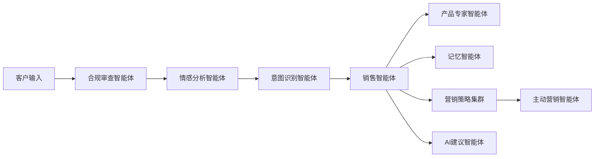

# MAS 智能营销助手

基于 LangGraph 的多智能体系统，专为美妆行业打造的数字化营销解决方案，通过 AI 智能体替代传统人工客服，实现自然人性化的销售对话。

## 🎯 项目概述

本系统构建了一个复杂的多智能体生态系统，包含 9 个专业化智能体协同工作，为美妆品牌提供：

- **🤖 智能销售对话** - 模拟专业美妆顾问的语调和专业知识
- **🎙️ 多模态交互** - 支持文字、语音、图像多种输入方式
- **🧠 持久化记忆** - 基于 Elasticsearch 的客户偏好记忆系统
- **📊 智能推荐** - RAG 驱动的个性化产品推荐引擎
- **🏢 多租户支持** - 支持多个美妆品牌独立运营
- **☁️ 云端部署** - Docker Compose 容器化部署方案

## 🏗️ 系统架构

### 九大智能体协作流程



### 智能体职责分工

1. **🛡️ 合规审查智能体** - 法规合规性验证，内容安全检查
2. **😊 情感分析智能体** - 客户情绪状态实时评估
3. **🎯 意图识别智能体** - 客户购买意图和需求分析
4. **💬 销售智能体** - 主要对话管理和销售策略执行
5. **🔍 产品专家智能体** - RAG 驱动的产品知识和推荐
6. **💾 记忆智能体** - 客户档案管理和上下文持久化
7. **📈 营销策略集群** - 四种专业化销售策略
   - 高端策略智能体（奢侈品路线）
   - 性价比策略智能体（实惠路线）
   - 年轻化策略智能体（Z世代路线）
   - 成熟策略智能体（抗衰路线）
8. **⚡ 主动营销智能体** - 基于行为触发的主动客户接触
9. **🤝 AI建议智能体** - 人机协作的智能建议系统

## 🚀 快速开始

### 系统要求

- Python 3.11+
- uv 包管理器
- Docker 和 Docker Compose
- OpenAI API 密钥

### 一键部署

1. **初始化开发环境**
   ```bash
   ./scripts/setup.sh
   ```

2. **配置环境变量**
   编辑 `.env` 文件，添加您的 OpenAI API 密钥：
   ```env
   OPENAI_API_KEY=your_openai_api_key_here
   ```

3. **启动所有服务**
   ```bash
   ./scripts/docker-dev.sh up
   ```

4. **运行应用程序**
   ```bash
   uv run uvicorn main:app --reload
   ```

### 手动部署

如果您偏好手动配置：

1. **安装依赖包**
   ```bash
   uv sync --all-extras
   ```

2. **启动基础设施服务**
   ```bash
   docker compose -f docker/docker-compose.yml up -d elasticsearch redis
   ```

3. **启动 API 服务器**
   ```bash
   uv run python main.py
   ```

## 📁 项目结构

```
mas-v0.2/
├── main.py                  # FastAPI 应用程序入口
├── src/
│   ├── agents/              # LangGraph 智能体实现
│   ├── memory/              # Elasticsearch 集成
│   ├── rag/                 # 检索增强生成系统
│   ├── multimodal/          # 语音和图像处理
│   ├── api/                 # API 路由处理器
│   └── utils/               # 共享工具函数
├── config/                  # 配置文件
├── docker/                  # Docker 配置
├── tests/                   # 测试套件
├── docs/                    # 项目文档
└── scripts/                 # 开发脚本
```

## 🛠️ 开发指南

### 可用脚本命令

- `./scripts/setup.sh` - 初始化开发环境
- `./scripts/docker-dev.sh up` - 启动所有服务
- `./scripts/docker-dev.sh down` - 停止所有服务
- `./scripts/docker-dev.sh logs` - 查看服务日志
- `./scripts/docker-dev.sh status` - 检查服务状态

### 运行测试

```bash
# 运行所有测试
uv run pytest

# 运行特定测试文件
uv run pytest tests/test_agents.py

# 运行覆盖率测试
uv run pytest --cov=src
```

### 代码质量检查

```bash
# 代码格式化
uv run black .
uv run isort .

# 类型检查
uv run mypy src/

# 代码规范检查
uv run flake8 src/
```

## 🌐 API 接口

启动后，API 服务将在以下地址可用：

- **📖 API 文档**: http://localhost:8000/docs
- **❤️ 健康检查**: http://localhost:8000/health
- **🏠 首页**: http://localhost:8000/

### 主要 API 端点

```bash
POST /api/v1/conversation/start     # 开始新对话
POST /api/v1/conversation/message   # 发送文字消息
POST /api/v1/conversation/voice     # 发送语音消息
POST /api/v1/conversation/image     # 发送图像消息
GET  /api/v1/conversation/history   # 获取对话历史
```

## 🏢 多租户支持

系统设计支持多租户运营，允许多个美妆品牌使用独立的智能体实例：

- **🔒 数据隔离** - 完全独立的客户数据存储
- **🎭 品牌个性** - 品牌专属的智能体语调和个性
- **📦 产品目录** - 独立的产品数据库管理
- **📊 分析报告** - 租户专属的数据分析

## 🔧 服务组件

启动后的服务地址：

- **🔍 Elasticsearch**: http://localhost:9200
- **🔴 Redis**: localhost:6379
- **🌐 API 服务器**: http://localhost:8000

## 📈 核心特性

### 智能对话能力
- 自然语言理解和生成
- 美妆专业知识问答
- 个性化产品推荐
- 多轮对话上下文保持

### 多模态交互
- **📝 文字对话** - 支持复杂的文字交流
- **🎤 语音识别** - Whisper 驱动的语音转文字
- **📷 图像分析** - GPT-4V 驱动的肌肤问题识别
- **🎨 肤色匹配** - 智能肤色分析和产品匹配

### 智能记忆系统
- 客户偏好记录
- 购买历史追踪
- 肌肤问题档案
- 跨会话记忆保持

### 营销自动化
- 购物车挽回
- 个性化促销推送
- 补货提醒
- 节日营销活动

## 🚀 下一步计划

1. **智能体框架实现** - 完成 LangGraph 智能体通信框架
2. **个体智能体开发** - 实现各专业智能体的核心功能
3. **多模态处理集成** - 添加语音和图像处理能力
4. **外部系统集成** - 连接现有电商和 CRM 系统
5. **生产环境部署** - 云端生产环境配置和优化

## 👨‍💻 贡献指南

1. 遵循代码风格规范（Black, isort）
2. 为新功能编写相应测试
3. 及时更新相关文档
4. 确保所有测试通过后再提交

## 📞 技术支持

如需技术支持或商务合作，请联系：

- **📧 邮箱**: consumerclone@outlook.com
- **🏢 团队**: HuanMu Team

## 🔄 版本历史

- **v0.1.0** - 初始版本，基础多智能体架构实现

---

> **注意**: 本系统注重医美和口腔垂直行业设计，具备强大的多智能体协作能力和多模态交互功能。通过智能化的客户服务，帮助商家提升销售转化率和客户满意度。
