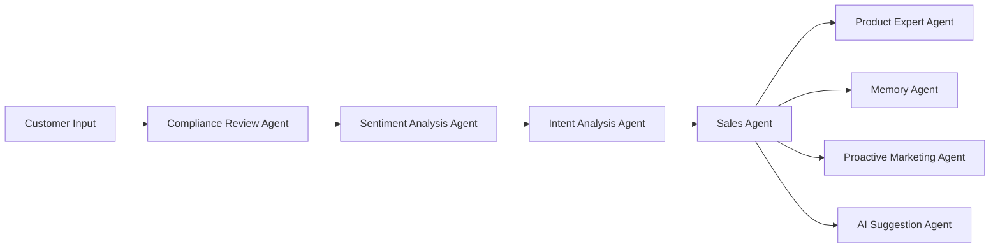

# MAS Intelligent Marketing Assistant

A sophisticated multi-agent system built on LangGraph, designed specifically for the cosmetic industry to revolutionize digital marketing solutions by replacing traditional customer service with AI agents for natural, humanized sales conversations.

## 🎯 Project Overview

This system builds a complex multi-agent ecosystem with 8 specialized agents working collaboratively to provide cosmetic brands with:

- **🤖 Intelligent Sales Conversations** - Simulating professional cosmetic consultant tone and expertise
- **🎙️ Multi-modal Interactions** - Supporting text, voice, and image input methods
- **🧠 Persistent Memory** - Elasticsearch-based customer preference memory system
- **📊 Intelligent Recommendations** - RAG-driven personalized product recommendation engine
- **🔄 Multi-LLM Support** - Integrated OpenAI, Anthropic, Gemini, DeepSeek intelligent routing
- **🏢 Multi-tenant Support** - Supporting independent operations for multiple cosmetic brands
- **☁️ Cloud Deployment** - Docker Compose containerized deployment solution
- **🔐 Enterprise Security** - JWT authentication, tenant isolation, rate limiting

## 🏗️ System Architecture

### Eight-Agent Collaboration Workflow



### Agent Responsibility Distribution

1. **🛡️ Compliance Review Agent** - Regulatory compliance validation and content security checks (8 modules)
2. **😊 Sentiment Analysis Agent** - Multi-modal emotional state real-time assessment (7 modules)
3. **🎯 Intent Analysis Agent** - Customer purchase intent and needs analysis
4. **💬 Sales Agent** - Primary conversation management and sales strategy execution (2 modules)
5. **🔍 Product Expert Agent** - RAG-driven product knowledge and recommendations (10 modules)
6. **💾 Memory Agent** - Customer profile management and multi-modal memory persistence (2 modules)
7. **⚡ Proactive Marketing Agent** - Behavior-triggered proactive customer engagement
8. **🤝 AI Suggestion Agent** - Human-AI collaboration intelligent suggestion system (8 modules)

## 🚀 Quick Start

### System Requirements

- Python 3.11+
- uv package manager
- Docker and Docker Compose
- LLM API keys (at least one of OpenAI, Anthropic, Gemini, DeepSeek)

### One-Click Deployment

1. **Initialize development environment**
   ```bash
   ./scripts/setup.sh
   ```

2. **Configure environment variables**
   Edit the `.env` file and add your LLM API keys:
   ```env
   # Configure at least one LLM provider
   OPENAI_API_KEY=your_openai_api_key_here
   ANTHROPIC_API_KEY=your_anthropic_api_key_here
   GOOGLE_API_KEY=your_google_api_key_here
   DEEPSEEK_API_KEY=your_deepseek_api_key_here
   
   # Optional: Configure default providers
   DEFAULT_LLM_PROVIDER=openai
   FALLBACK_LLM_PROVIDER=anthropic
   ```

3. **Start all services**
   ```bash
   ./scripts/docker-dev.sh up
   ```

4. **Run the application**
   ```bash
   uv run python main.py
   ```

### Manual Deployment

If you prefer manual configuration:

1. **Install dependencies**
   ```bash
   uv sync --all-extras
   ```

2. **Start infrastructure services**
   ```bash
   docker compose -f docker/docker-compose.yml up -d elasticsearch redis postgresql milvus
   ```

3. **Start API server**
   ```bash
   uv run python main.py
   ```

## 📁 Project Structure

```
mas-v0.2/
├── main.py                  # Uvicorn entry point (runs api/main.py)
├── api/                     # Complete API layer
│   ├── endpoints/           # 10 REST API endpoint modules
│   │   ├── conversations.py # Conversation processing and management
│   │   ├── agents.py        # Agent testing and management
│   │   ├── llm_management.py # Multi-LLM provider management
│   │   ├── multimodal.py    # Multi-modal processing
│   │   ├── health.py        # System health monitoring
│   │   ├── assistants.py    # AI assistant management
│   │   ├── prompts.py       # Prompt template management
│   │   ├── tenant.py        # Multi-tenant management
│   │   └── service_auth.py  # Authentication endpoints
│   ├── handlers/            # Business logic handlers
│   ├── middleware/          # JWT auth, security interceptor, tenant isolation, rate limiting
│   ├── schemas/             # Comprehensive Pydantic models
│   └── dependencies/        # Dependency injection
├── src/                     # Core business logic
│   ├── agents/              # 8 modular agents (37 sub-modules)
│   ├── core/                # LangGraph workflow orchestration
│   ├── llm/                 # Multi-LLM provider system (16 modules)
│   ├── memory/              # Elasticsearch storage (11 modules)
│   ├── multimodal/          # Voice and image processing (12 modules)
│   ├── rag/                 # Retrieval-augmented generation system
│   └── utils/               # Shared utility functions
├── infra/                   # Infrastructure components
│   ├── auth/                # JWT authentication system
│   ├── cache/               # Redis integration
│   ├── db/                  # Database connections
│   └── monitoring/          # Health monitoring
├── external/                # External service clients
├── config/                  # Application configuration
├── tests/                   # Comprehensive test suite (22 modules)
│   ├── agents/              # Agent tests (including Chinese optimization)
│   ├── llm/                 # Multi-LLM provider tests
│   ├── api/                 # API endpoint tests
│   └── auth/                # Authentication tests
├── docs/                    # Documentation and memory bank
└── scripts/                 # Development scripts
```

## 🛠️ Development Guide

### Available Script Commands

- `./scripts/setup.sh` - Initialize development environment
- `./scripts/docker-dev.sh up` - Start all services
- `./scripts/docker-dev.sh down` - Stop all services
- `./scripts/docker-dev.sh logs` - View service logs
- `./scripts/docker-dev.sh status` - Check service status

### Running Tests

```bash
# Run all tests
uv run pytest

# Run specific test file
uv run pytest tests/test_agents.py

# Run coverage tests
uv run pytest --cov=src
```

## 🌐 API Interface

After startup, API services will be available at:

- **📖 API Documentation**: http://localhost:8000/docs
- **❤️ Health Check**: http://localhost:8000/health
- **🏠 Home**: http://localhost:8000/

### Main API Endpoints

```bash
# Conversation Management
POST /v1/chat/start                 # Start new conversation
POST /v1/chat/message               # Send text message
GET  /v1/chat/history               # Get conversation history
POST /v1/chat/{id}/export           # Export conversation

# Agent Management
GET  /v1/agents                     # List all agents
POST /v1/agents/{id}/test           # Test specific agent
GET  /v1/agents/{id}/metrics        # Get agent metrics

# Multi-LLM Management
GET  /v1/llm/providers              # List LLM providers
GET  /v1/llm/costs                  # Cost analysis
POST /v1/llm/optimize               # Optimize provider selection

# Multi-modal Processing
POST /v1/multimodal/voice           # Process voice input
POST /v1/multimodal/image           # Process image input

# Tenant Management
GET  /v1/tenants                    # List tenants
POST /v1/tenants                    # Create tenant

# Authentication
POST /v1/auth/token                 # Get authentication token
```

## 🏢 Multi-tenant Support

The system is designed to support multi-tenant operations, allowing multiple cosmetic brands to use independent agent instances:

- **🔒 Data Isolation** - Completely independent customer data storage
- **🎭 Brand Personality** - Brand-specific agent tone and personality
- **📦 Product Catalog** - Independent product database management
- **📊 Analytics Reports** - Tenant-specific data analysis

## 🔧 Service Components

Service addresses after startup:

- **🌐 API Server**: http://localhost:8000 (main FastAPI application)
- **🔍 Elasticsearch**: http://localhost:9200 (conversation storage and customer memory)
- **🔴 Redis**: localhost:6379 (caching and session management)
- **🐘 PostgreSQL**: localhost:5432 (tenant management and isolation)
- **🔍 Milvus**: localhost:19530 (vector database for RAG operations)

## 📈 Core Features

### Intelligent Conversation Capabilities
- **Multi-LLM Support** - Integrated OpenAI, Anthropic, Gemini, DeepSeek
- **Intelligent Routing** - Context-based automatic provider selection
- **Cost Optimization** - Real-time cost tracking with 30-40% cost reduction potential
- **Natural Language Understanding** - cosmetic professional knowledge Q&A and personalized recommendations
- **Multi-turn Conversations** - Context preservation and conversation state management

### Multi-modal Interactions
- **📝 Text Conversations** - Supporting complex text communication
- **🎤 Voice Recognition** - Whisper-powered speech-to-text
- **📷 Image Analysis** - GPT-4V-powered skin issue identification
- **🎨 Skin Tone Matching** - Intelligent skin tone analysis and product matching

### Intelligent Memory System
- **Elasticsearch Storage** - High-performance customer preference recording and conversation history
- **Multi-modal Memory** - Unified storage of text, voice, and image content
- **Customer Profiles** - Purchase history and skin issue profiles
- **Cross-session Persistence** - Intelligent context preservation and memory retrieval

### Marketing Automation
- Shopping cart recovery
- Personalized promotional campaigns
- Restock reminders
- Holiday marketing activities

## ✅ Completed Features

1. **✅ Multi-agent Architecture** - Complete LangGraph agent communication framework
2. **✅ 8 Professional Agents** - All agent core functionality implemented (37 sub-modules)
3. **✅ Multi-modal Processing** - Voice and image processing capabilities fully integrated
4. **✅ Multi-LLM Integration** - Intelligent routing system for 4 major providers
5. **✅ Enterprise API** - Complete REST API and authentication system
6. **✅ Comprehensive Testing** - Complete test suite with 22 test modules
7. **✅ Production Ready** - Monitoring, health checks, performance optimization

## 🚀 Next Steps

1. **External System Integration** - Connect with existing e-commerce and CRM systems
2. **Cloud Production Deployment** - Kubernetes and cloud environment configuration
3. **AI Capability Enhancement** - Advanced recommendation algorithms and personalization
4. **Performance Optimization** - Large-scale concurrent processing optimization

## 👨‍💻 Contributing Guidelines

1. **Code Quality Standards**
   - File size: <300 lines (100% compliance achieved)
   - Function size: <150 lines (100% compliance achieved)
   - Follow code style guidelines (Black, isort)

2. **Development Workflow**
   - Write appropriate tests for new features
   - Update relevant documentation promptly
   - Ensure all tests pass before submission
   - Maintain modular design principles

## 📞 Technical Support

For technical support or business cooperation, please contact:

- **📧 Email**: consumerclone@outlook.com
- **🏢 Team**: HuanMu Team

## 🔄 Version History

- **v0.2.0** - Production-ready version (August 2025)
  - ✅ Complete multi-LLM provider integration
  - ✅ Comprehensive API layer refactoring
  - ✅ Modular agent architecture
  - ✅ Enterprise-grade authentication and security
  - ✅ Comprehensive test coverage
- **v0.1.0** - Initial version, basic multi-agent architecture implementation

## 🏆 Technical Highlights

- **🏗️ Modular Architecture** - All components follow single responsibility principle, easy to maintain and extend
- **🔄 Multi-LLM Intelligent Routing** - Context-aware provider selection with 30-40% cost optimization
- **⚡ High-performance Design** - Millisecond memory retrieval, supporting 1000+ messages per second
- **🔐 Enterprise Security** - JWT authentication, tenant isolation, rate limiting, audit logging
- **🧪 Comprehensive Testing** - 22 test modules ensuring production environment stability
- **🌍 Chinese Optimization** - Language models specifically optimized for the Chinese cosmetic industry

---

> **Production Ready**: This system is specifically designed for the Chinese cosmetic industry, featuring powerful multi-agent collaboration capabilities, multi-modal interaction functions, and enterprise-grade reliability. Through intelligent customer service, it helps brands improve sales conversion rates and customer satisfaction, and is now fully prepared for production environment deployment.